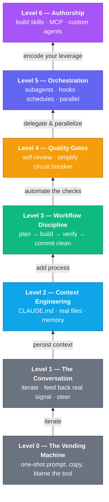

# ai-leverage

**The Map for Getting Good at Working with AI**

A practical, opinionated field guide to *how to actually get good* at working with an AI coding assistant — seven levels from "fancy autocomplete" to "AI as a system you operate." Built around Claude Code, but the principles transfer to any capable model. Each level shows where most people get stuck, the one unlock that moves them up, and exactly what it looks like in practice.

**The thesis:** The gap between a beginner and an expert using the *same* AI is bigger than the gap between two different models. Same Claude, same prompt budget, wildly different results. The difference isn't the tool — it's the *operating skill*. This repo is the map for closing that gap.
**Companion to:** [claude-skillcraft](https://github.com/ProjectWaja/claude-skillcraft) — where this guide is the *map*, skillcraft is the *gear* (12 installable skills that make the higher levels automatic).

## Start Here

| | |
|---|---|
| **The 60-second self-check** | [Which level are you?](#which-level-are-you) — find your real starting point |
| **Read straight through** | [Level 0 → The Vending Machine](levels/0-vending-machine.md) — the floor, then climb |
| **The capstone** | [One task at every level](examples/same-task-every-level.md) — "add login" played from Level 0 to 6 |
| **The gear** | [claude-skillcraft](https://github.com/ProjectWaja/claude-skillcraft) — skills that encode Levels 3–6 |
| **Contribute** | [CONTRIBUTING.md](CONTRIBUTING.md) — real before/after transcripts wanted |

---

## Table of Contents

- [The Premise](#the-premise) — why two people get wildly different results from the same model
- [The Climb](#the-climb) — the seven levels at a glance
- [The Map](#the-map) — each level, the unlock, and where it lives in Claude Code
- [Which Level Are You?](#which-level-are-you) — a 60-second honest self-assessment
- [Where the Skills Come In](#where-the-skills-come-in) — how claude-skillcraft maps to the levels
- [What Makes This Different](#what-makes-this-different) — why a *map*, not another tips list
- [A Note on Models](#a-note-on-models) — what's Claude-specific and what isn't
- [Contributing](#contributing)

---

## The Premise

Most people plateau at Level 0 or 1: they treat a world-class collaborator like a vending machine, get mediocre output, and conclude "AI isn't that good yet." They're not wrong about their *results*. They're wrong about the *cause*.

The model isn't underpowered. It's under-informed, under-directed, and cut off mid-thought. Every one of those is a skill you can fix — and each fix is a *level*.

This repo maps the climb from *fancy autocomplete* to *AI as a system you operate*. Seven levels. Each one is a real unlock you can practice today, with a concrete before/after and the exact Claude Code feature or skill that gets you there.

---

## The Climb

> Most working developers live at **Level 1**. Most people who consider themselves "good with AI" are at **2–3**. The compounding returns — the part that feels like a different tool entirely — start at **Level 4**.

---

## The Map

Each level builds on the one below it. You don't skip levels — but you climb faster than you'd think once you can see the pattern.

| Level | Name | Where most people are | The unlock |
|------:|------|-----------------------|------------|
| **0** | [The Vending Machine](levels/0-vending-machine.md) | One-shot prompt, copy the answer, blame the AI when it's wrong | *(this is the floor — everything else is up)* |
| **1** | [The Conversation](levels/1-conversation.md) | Give up after one bad answer | Iterate. Treat it as dialogue, feed back errors, steer |
| **2** | [Context Engineering](levels/2-context-engineering.md) | Re-explain the project every single time | Persistent context: `CLAUDE.md`, real files, memory |
| **3** | [Workflow Discipline](levels/3-workflow-discipline.md) | "Just start coding," then debug for hours | Plan before code, verify after, commit clean |
| **4** | [Quality Gates](levels/4-quality-gates.md) | *You* are the only thing checking the output | The AI checks its own work — and knows when to stop |
| **5** | [Orchestration](levels/5-orchestration.md) | One task, one chat, watch it work | Delegate and parallelize: subagents, hooks, schedules |
| **6** | [Authorship](levels/6-authorship.md) | Consume AI exactly as it ships | Build your own leverage: skills, MCP, custom agents |

---

## Which Level Are You?

Answer honestly. Your level is the **highest** number where you can say "yes, I do that consistently."

| Level | You can honestly say… |
|------:|------------------------|
| **0** | I paste a prompt, take what comes out, and move on. |
| **1** | When the answer is wrong, I tell it *what's* wrong and we go again. |
| **2** | My project has a `CLAUDE.md` (or equivalent) so I don't re-explain conventions, and I point the AI at real files instead of pasting snippets. |
| **3** | For non-trivial work I get a plan first, and I verify the result before calling it done. |
| **4** | My setup catches its own mistakes — bad output gets flagged before I see it, and runaway debug loops get interrupted. |
| **5** | I routinely run work in parallel, delegate sub-tasks to subagents, and automate repeated steps with hooks or schedules. |
| **6** | I've built my own skills / tools / MCP servers that encode my standards — and I share them. |

> **Where most people land:** working developers at **1**, self-described "power users" at **2–3**. Levels **4–6** are where the leverage compounds — and where almost nobody is.

---

## Where the Skills Come In

Levels 3 and up are easier to *hold* when the discipline is **encoded, not remembered**. That's exactly what [**claude-skillcraft**](https://github.com/ProjectWaja/claude-skillcraft) is — a companion pack of 12 Claude Code skills, organized into the same tiers this guide describes:

| This guide | claude-skillcraft skills | What they make automatic |
|------------|--------------------------|--------------------------|
| **Level 3 — Workflow** | [`plan-first`](https://github.com/ProjectWaja/claude-skillcraft/tree/main/skills/plan-first) · [`ship-cycle`](https://github.com/ProjectWaja/claude-skillcraft/tree/main/skills/ship-cycle) · [`verify-build`](https://github.com/ProjectWaja/claude-skillcraft/tree/main/skills/verify-build) · [`clean-commit`](https://github.com/ProjectWaja/claude-skillcraft/tree/main/skills/clean-commit) · [`task-resume`](https://github.com/ProjectWaja/claude-skillcraft/tree/main/skills/task-resume) | Plan before code, verify after, commit clean, resume across sessions |
| **Level 4 — Quality** | [`output-guard`](https://github.com/ProjectWaja/claude-skillcraft/tree/main/skills/output-guard) · [`simplify-code`](https://github.com/ProjectWaja/claude-skillcraft/tree/main/skills/simplify-code) · [`debug-circuit`](https://github.com/ProjectWaja/claude-skillcraft/tree/main/skills/debug-circuit) · [`craft-principles`](https://github.com/ProjectWaja/claude-skillcraft/tree/main/skills/craft-principles) | Self-review, kill over-engineering, break debug loops, enforce principles |
| **Level 6 — Authorship** *(applied beyond code)* | [`pm-docs`](https://github.com/ProjectWaja/claude-skillcraft/tree/main/skills/pm-docs) · [`sprint-flow`](https://github.com/ProjectWaja/claude-skillcraft/tree/main/skills/sprint-flow) · [`meeting-driver`](https://github.com/ProjectWaja/claude-skillcraft/tree/main/skills/meeting-driver) | Product thinking made executable: PRDs, sprints, meetings |

This guide explains *why* each unlock matters. Skillcraft is *how* you make it stick. You can read every word here with zero skills installed — the unlocks are **habits first, tools second**.

---

## What Makes This Different

1. **It's a map, not a tips list.** "10 ChatGPT prompts" listicles give you tactics with no terrain. This gives you a *progression* — you always know where you are, what the next unlock is, and why it matters.

2. **It names where you're stuck.** Every level leads with the *bad habit it replaces*. You can't climb until you can see the floor you're standing on.

3. **Every level has a concrete before/after.** No abstractions. Real prompts, real transcripts, the dumb way next to the leveled-up way — including a [capstone](examples/same-task-every-level.md) that runs one task through all seven levels.

4. **It connects principle to tool.** Each unlock points at the specific Claude Code feature (`CLAUDE.md`, subagents, hooks, MCP) or [skillcraft skill](https://github.com/ProjectWaja/claude-skillcraft) that makes it real — so "get better" becomes "do this."

5. **It tops out at authorship.** Most guides stop at "write better prompts." This one ends where the real leverage is: building the tools, skills, and systems that make the lower levels automatic for you and everyone downstream.

---

## A Note on Models

Everything here is written against [Claude Code](https://claude.com/claude-code) because that's what we use, and because it has first-class support for the higher-level unlocks (skills, subagents, hooks, MCP). But **Levels 0–4 are model-agnostic habits.** If you're on a different assistant, read past the product names — the climb is the same.

---

## Contributing

This is a living map. If a level is missing a sharper example, or you've found an unlock we haven't named, see [CONTRIBUTING.md](CONTRIBUTING.md). Real before/after transcripts are the single most valuable thing you can add.

---

**Author:** Willis Tang — [@ProjectWaja](https://github.com/ProjectWaja) | Project Waja
**Companion:** [claude-skillcraft](https://github.com/ProjectWaja/claude-skillcraft)
**License:** MIT — see [LICENSE](LICENSE)
